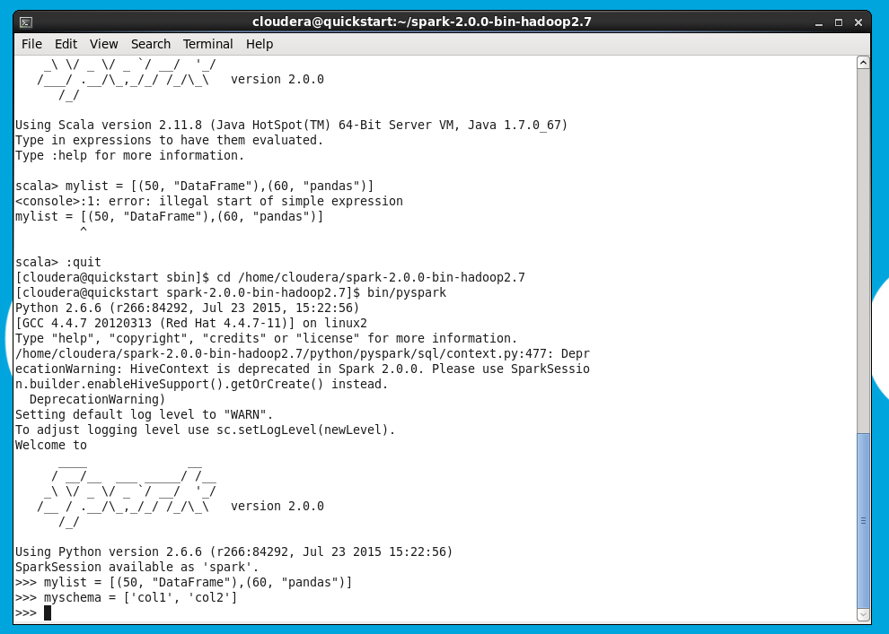

## Spark SQL | Dataframes | Datasets

<!-- TABLE OF CONTENTS -->

  
Daftar Isi

  <ol>
    <li>
      <a href="#analitik-dengan-dataframes">Analitik dengan DataFrames</a>
      <ul>
        <li><a href="#membuat-dataframes">Membuat DataFrames</a></li>
        <li><a href="#kode-1">Kode 1</a></li>
        <li><a href="#metode-1-:-membuat-dataframe-dengan-objek-list-schema dan-default-data-types">Metode 1: Membuat DataFrame dengan objek list, schema dan default data types</a></li>
        <li><a href="#kode-2">Kode 2</a></li>
        <li><a href="#metode-2-:-membuat-dataframe-dengan-parallelizing-list-dan-konversi-rdd-ke-dataframe">Metode 2: Membuat DataFrame dengan parallelizing list dan konversi RDD ke DataFrame</a></li>
        <li><a href="#kode-3">Kode 3</a></li>
        <li><a href="#metode-3-:-read-data-from-a-file-infer-schema-and-convert-to-dataframe">Metode 3: Read data from a file, Infer schema and convert to DataFrame</a></li>
        <li><a href="#kode-4">Kode 4</a></li>
        <li><a href="#kode-5">Kode 5</a></li>
        <li><a href="#metode-4-:-membaca-data-dari-file-lalu-assign-schema-secara-programmatically">Metode 4: Membaca data dari file, lalu assign schema secara programmatically</a></li>
        <li><a href="#kode-6">Kode 6</a></li>
      </ul>
    </li>
    <li>
      <a href="#membuat-dataframe-dari-database-eksternal">Membuat DataFrame dari Database Eksternal</a>
      <ul>
        <li><a href="#metode-3-1">Metode 3-1</a></li>
        <li><a href="#kode-7">Kode 7</a></li>
        <li><a href="#metode-3-2">Metode 3-2</a></li>
        <li><a href="#kode-8">Kode 8</a></li>
      </ul>
    </li>
    <li>
      <a href="#mengonversi-dataframes-ke-rdds">Mengonversi DataFrames ke RDDs</a>
      <ul>
        <li><a href="#kode-9">Kode 9</a></li>
      </ul>
    </li>
    <li>
      <a href="#membuat-datasets">Membuat Datasets</a>
      <ul>
        <li><a href="#kode-10">Kode 10</a></li>
        <li><a href="#kode-11">Kode 11</a></li>
      </ul>
    </li>
    <li>
      <a href="#mengonversi-dataframe-ke-datasets-dan-sebaliknya">Mengonversi DataFrame ke Datasets dan sebaliknya</a>
      <ul>
        <li><a href="#kode-12">Kode 12</a></li>
      </ul>
    </li>
    <li>
      <a href="#mengakses-metadata-menggunakan-catalog">Mengakses Metadata menggunakan Catalog</a>
      <ul>
        <li><a href="#kode-13">Kode 13</a></li>
      </ul>
    </li>
    <li>
      <a href="#bekerja-dengan-berkas-teks">Bekerja dengan berkas teks</a>
      <ul>
        <li><a href="#kode-14">Kode 14</a></li>
      </ul>
    </li>
    <li>
      <a href="#bekerja-dengan-json">Bekerja dengan JSON</a>
      <ul>
        <li><a href="#kode-15">Kode 15</a></li>
        <li><a href="#kode-16">Kode 16</a></li>
        <li><a href="#kode-17">Kode 17</a></li>
      </ul>
    </li>
    <li>
      <a href="#bekerja-dengan-csv">Bekerja dengan CSV</a>
      <ul>
        <li><a href="#kode-18">Kode 18</a></li>
      </ul>
    </li>
  </ol>

<!-- Analitik dengan DataFrames -->
# Analitik dengan DataFrames
  ## Membuat DataFrames
  
  
  
  > ### Kode 1
      
      mylist = [(50, "DataFrame"),(60, "pandas")]
      myschema = ['col1', 'col2']
      
   + Penjelasan
     - mylist  
        > sebuah objek list dalam bahasa pemrograman Python yang berisi tuple dengan dua elemen. Elemen pertama dari setiap tuple adalah bilangan bulat dan elemen kedua adalah sebuah string. 

     - myschema  
        > sebuah objek list dalam bahasa pemrograman Python yang berisi dua elemen berupa string. Elemen dalam _myschema_ mewakili nama kolom dalam sebuah tabel atau dataframe.
        
  ## Metode 1: Membuat DataFrame dengan objek list, schema dan default data types
  
  
  
  > ### Kode 2

      df1 = spark.createDataFrame(mylist, myschema)

   + Penjelasan
     - spark.createDataFrame  

        > sebuah fungsi dalam framework Apache Spark yang digunakan untuk membuat sebuah DataFrame baru dari data yang ada.

  ## Metode 2: Membuat DataFrame dengan parallelizing list dan konversi RDD ke DataFrame
  
  
  
  > ### Kode 3

      df2 = sc.parallelize(mylist).toDF(myschema)

   + Penjelasan
     - parallelize  
        > sebuah fungsi dalam Apache Spark yang digunakan untuk mengubah sebuah collection menjadi RDD (Resilient Distributed Datasets), yaitu tipe data dasar yang digunakan dalam pemrograman dengan Spark.
        
     - toDF  
        > membuat DataFrame baru dari RDD, digunakan untuk membuat DataFrame baru dengan kolom-kolom yang disesuaikan

  ## Metode 3: Read data from a file, Infer schema and convert to DataFrame
  
  
  
  > ### Kode 4

      hadoop fs -put /examples/resources/people.txt people.txt
      
   + Penjelasan
     - hadoop  
        > sebuah framework yang digunakan untuk memproses data secara distribusi pada cluster komputer yang besar.
        
     - fs  
        > adalah command line interface (CLI) pada Hadoop yang digunakan untuk mengakses sistem file Hadoop (Hadoop Distributed File System atau HDFS). _fs_ dapat digunakan untuk membaca, menulis, dan memanipulasi file pada HDFS.
        
     - put  
        > adalah opsi pada command fs yang digunakan untuk mengunggah sebuah file dari sistem lokal ke HDFS.
  
  
  
  > ### Kode 5

      from pyspark.sql import SQLContext, Row
      peopleRDD = sc.textFile("people.txt")
      people_sp = peopleRDD.map(lambda l: l.split(","))
      people = people_sp.map(lambda p: Row(name=p[0], age=int(p[1])))
      df_people = spark.createDataFrame(people)
      df_people.createOrReplaceTempView("people")
      spark.sql("SHOW TABLES").show()
      spark.sql("SELECT name,age FROM people where age > 19").show()

   + Penjelasan
     - pyspark.sql  
        > adalah modul dalam Apache Spark yang digunakan untuk memproses data terstruktur (structured data) dalam format DataFrame dan SQL.
        
     - SQLContext  
        > adalah kelas dalam modul pyspark.sql yang digunakan untuk menginisialisasi sebuah konteks SQL dalam Spark. Objek _SQLContext_ dapat digunakan untuk membuat DataFrame dari berbagai sumber data, seperti RDD atau file, serta melakukan operasi SQL pada DataFrame tersebut.
        
     - createOrReplaceTempView  
        > sebuah method pada objek DataFrame yang digunakan untuk membuat sebuah tampilan (view) sementara dari DataFrame. Tampilan tersebut dapat digunakan untuk melakukan operasi SQL seperti pada tabel, tanpa harus menyimpan DataFrame sebagai tabel fisik.
        
     - show  
        > sebuah method pada objek DataFrame yang digunakan untuk menampilkan isi DataFrame dalam bentuk tabel.
        
  ## Metode 4: Membaca data dari file, lalu assign schema secara programmatically
  
  
  
  > ### Kode 6

      from pyspark.sql import SQLContext, Row
      peopleRDD = sc.textFile("people.txt")
      people_sp = peopleRDD.map(lambda l: l.split(","))
      people = people_sp.map(lambda p: Row(name=p[0], age=int(p[1])))
      df_people = people_sp.map(lambda p: (p[0], p[1].strip()))
      schemaStr = "name age"
      fields = [StructField(field_name, StringType(), True) \
      for field_name in schemaStr.split()]
      schema = StructType(fields)
      df_people = spark.createDataFrame(people,schema)
      df_people.show()
      df_people.createOrReplaceTempView("people")
      spark.sql("select * from people").show() 

   + Penjelasan
     - textFile  
        > digunakan untuk membaca file dari Hadoop Distributed File System (HDFS) atau dari file lokal. Method ini mengembalikan RDD yang berisi baris-baris dalam file.
        
     - map  
        > method pada RDD yang digunakan untuk mengaplikasikan sebuah fungsi pada setiap elemen dalam RDD dan menghasilkan RDD baru.
        
     - lambda  
        > cara untuk mendefinisikan sebuah fungsi anonim dalam Python.
        
     - strip  
        > method pada string yang digunakan untuk menghapus karakter whitespace (spasi, tab, newline) pada awal dan akhir string.
        
     - StructField  
        > kelas pada modul _pyspark.sql.types_ yang digunakan untuk mendefinisikan sebuah kolom pada DataFrame.
        
     - StringType  
        > tipe data untuk kolom dalam DataFrame yang berisi string.
        

(<a href="#readme-top">back to top</a>)

<!-- Membuat DataFrame dari Database Eksternal-->
# Membuat DataFrame dari Database Eksternal
  ## Metode 3-1
  
  
  
  > ### Kode 7
  
      df1 = spark.read.format('jdbc').options(url='jdbc:mysql://ebt-polinema.id:3306/polinema_pln?user=ebt&password=EBT@2022@pltb', dbtable='t_wind_turbine').load()
      df1.show()

   + Penjelasan
     - spark.read.format  
        > method pada objek spark (SparkSession) yang digunakan untuk membaca data dari berbagai format data, termasuk JDBC.
        
     - jdbc  
        > format data yang digunakan untuk membaca data dari database menggunakan JDBC.
        
     - options  
        > method yang digunakan untuk mengatur opsi-opsi konfigurasi saat membaca data dari sumber data tertentu, seperti database.
        
     - load  
        > method yang digunakan untuk membaca data dari sumber data dan mengembalikan sebuah DataFrame.

  ## Metode 3-2
  
  
  
  > ### Kode 8

      df2 = spark.read.format('jdbc').options(url='jdbc:mysql://ebt-polinema.id:3306/polinema_pln', dbtable='t_wind_turbine', user='ebt', password='EBT@2022@pltb').load()
      df2.show()

   + Penjelasan
     - show  
        > method pada objek DataFrame yang digunakan untuk menampilkan beberapa baris data dari DataFrame tersebut ke dalam output console. 

(<a href="#readme-top">back to top</a>)

<!-- Mengonversi DataFrames ke RDDs -->
# Mengonversi DataFrames ke RDDs

  
  
  > ### Kode 9

      # Create DataFrame
      mylist = [(1, "Nama-NIM"),(3, "Big Data 2023")]
      myschema = ['col1', 'col2']
      df = spark.createDataFrame(mylist, myschema)

      #Convert DF to RDD
      df.rdd.collect()

      df2rdd = df.rdd
      df2rdd.take(2)

   + Penjelasan
     - collect  
        > method pada objek DataFrame yang digunakan untuk mengumpulkan seluruh data pada DataFrame ke dalam bentuk array. Method ini dapat digunakan untuk memproses seluruh data pada DataFrame di dalam driver program
        
     - rdd  
        > property pada objek DataFrame yang digunakan untuk mengkonversi DataFrame ke RDD.
        
     - take  
        > method pada objek RDD yang digunakan untuk mengambil n baris pertama dari RDD dan mengembalikannya dalam bentuk array.
        

(<a href="#readme-top">back to top</a>)

<!-- Membuat Datasets -->
# Membuat Datasets
  
  
  
  > ### Kode 10

      case class Dept(dept_id: Int, dept_name: String)
      
      val deptRDD = sc.makeRDD(Seq(Dept(1,"Sales"),Dept(2,"HR")))
      
      val deptDS = spark.createDataset(deptRDD)
      
      val deptDF = spark.createDataFrame(deptRDD)

   + Penjelasan
     - makeRDD  
        > digunakan untuk membuat RDD (Resilient Distributed Dataset) pada Spark.
        
     - Seq  
        > tipe data di Scala yang merepresentasikan sebuah urutan (sequence) dari beberapa elemen. Pada kode tersebut, Seq digunakan untuk membuat sebuah sequence yang berisi dua buah objek dari kelas Dept.
        
     - createDataset  
        > digunakan untuk membuat sebuah dataset pada Spark. Dataset adalah sebuah struktur data yang dapat merepresentasikan data terstruktur pada Spark. Fungsi createDataset digunakan untuk membuat sebuah dataset dari RDD yang ada.
  
  
  
  > ### Kode 11
  
      deptDS.rdd
      
      //res12: org.apache.spark.rdd.RDD[Dept] = MapPartitionsRDD[5] at rdd at 
      //<console>:31
      
      deptDF.rdd
      
      //res13: org.apache.spark.rdd.RDD[org.apache.spark.sql.Row] = //MapPartitionsRDD[8] at rdd at <console>:31

      deptDS.filter(x => x.dept_location > 1).show()

   + Penjelasan
     - filter  
        > fungsi pada Spark yang digunakan untuk memilih data dari suatu RDD (Resilient Distributed Dataset) atau DataFrame berdasarkan kriteria tertentu.

(<a href="#readme-top">back to top</a>)

<!-- Mengonversi DataFrame ke Datasets dan sebaliknya -->
# Mengonversi DataFrame ke Datasets dan sebaliknya
  
  
  
  > ### Kode 12
  
      val newDeptDS = deptDF.as[Dept]
      
      newDeptDS.show()
      
      newDeptDS.first()
      
      // mengonversi ke DataFrame kembali
      newDeptDS.toDF.first()

   + Penjelasan
     - as  
        > digunakan untuk mengkonversi DataFrame ke Dataset.
        
     - toDF  
        > digunakan untuk mengkonversi Dataset kembali ke DataFrame.
        
     - first  
        > digunakan untuk mengambil baris pertama dari Dataset atau DataFrame.

(<a href="#readme-top">back to top</a>)

<!-- Mengakses Metadata menggunakan Catalog -->
# Mengakses Metadata menggunakan Catalog
  
  
  
  > ### Kode 13

      spark.catalog.listDatabases().select("name").show()
      
      spark.catalog.listTables.show()
      
      spark.catalog.isCached("sample_07")
      
      spark.catalog.listFunctions().show()

   + Penjelasan
     - listDatabases  
        > digunakan untuk mendapatkan daftar database
        
     - listTables  
        > digunakan untuk mendapatkan daftar tabel
        
     - listFunctions  
        > digunakan untuk mendapatkan daftar fungsi
        
     - isCached  
        > akan mengembalikan nilai true jika tabel sudah di-cache dan false jika belum.
        
     - select  
        > digunakan untuk memilih kolom dari tabel daftar database       

(<a href="#readme-top">back to top</a>)

<!-- Bekerja dengan berkas teks -->
# Bekerja dengan berkas teks
  
  
  
  > ### Kode 14

      df_txt = spark.read.text("people.txt")
      df_txt.show()
      df_txt

   + Penjelasan
     - Read  
        > digunakan untuk membaca data dari berbagai sumber data seperti file atau database.
        
     - text  
        > fungsi bawaan Spark yang digunakan untuk membaca file teks sebagai dataset DataFrame.

(<a href="#readme-top">back to top</a>)

<!-- Bekerja dengan JSON -->
# Bekerja dengan JSON
  
  
  
  > ### Kode 15

      df_json = spark.read.load("people.json", format="json")
      df_json = spark.read.json("people.json")
      df_json.printSchema()
      
      df_json.show()

   + Penjelasan
     - load  
        > fungsi bawaan Spark untuk membaca data dari sumber data yang berbeda dalam berbagai format seperti CSV, JSON, Avro, Parquet, ORC, dan format file lainnya. 
        
     - json  
        > method khusus untuk membaca file json pada Spark.
        
     - format  
        > dibaca menggunakan method load dengan parameter format
        
     - printSchema  
        > digunakan untuk menampilkan skema dari data frame. Skema menunjukkan struktur dari data, termasuk kolom, tipe data kolom, dan informasi lain yang berkaitan dengan skema data.

  
  
  > ### Kode 16
  
      df_json.write.json("newjson_dir")
      df_json.write.format("json").save("newjson_dir2")

   + Penjelasan
     - write  
        > digunakan untuk menulis DataFrame atau Dataset ke sumber data eksternal seperti file atau database.
        
     - save  
        > untuk menyimpan DataFrame ke sebuah lokasi tertentu, dengan format file tertentu

  
  
  
  > ### Kode 17

      df_json.write.parquet("parquet_dir")
      df_json.write.format("parquet").save("parquet_dir2")
     
   + Penjelasan
     - parquet  
        > format penyimpanan kolom-oriented yang dirancang untuk efisiensi dan kompresi data yang tinggi.

(<a href="#readme-top">back to top</a>)

<!-- Bekerja dengan CSV -->
# Bekerja dengan CSV
  
  
  
  > ### Kode 18

      csv_df = spark.read.options(header='true',inferSchema='true').csv("cars.csv")
      
      csv_df.printSchema()
      
      csv_df.select('year', 'model').write.options(codec="org.apache.hadoop.io.compress.GzipCodec").csv('newcars.csv')

   + Penjelasan
     - Options  
        > sebuah metode yang berfungsi untuk menambahkan opsi konfigurasi saat membaca data dari file atau database.
        
     - inferSchema  
        > opsi konfigurasi yang digunakan untuk mengizinkan Spark melakukan infer terhadap schema dari data yang dibaca dari file.
        
     - csv  
        > metode untuk membaca file data dalam format csv.
        
     - header  
        > opsi konfigurasi yang menandakan bahwa file data memiliki baris header.
        
     - codec  
        > opsi konfigurasi yang digunakan untuk menyimpan data dalam format kompresi tertentu.
        

(<a href="#readme-top">back to top</a>)

